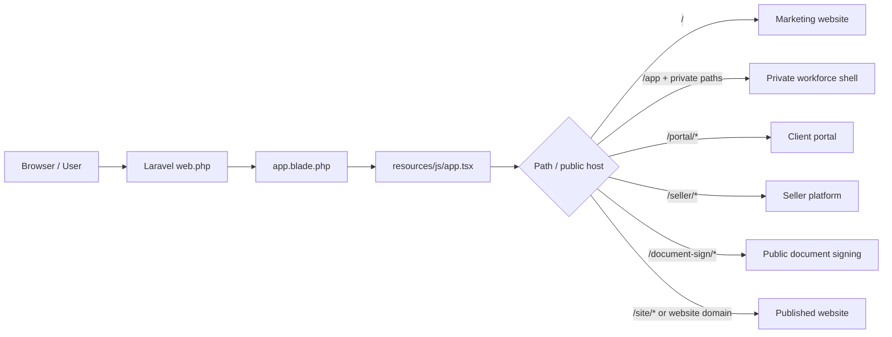
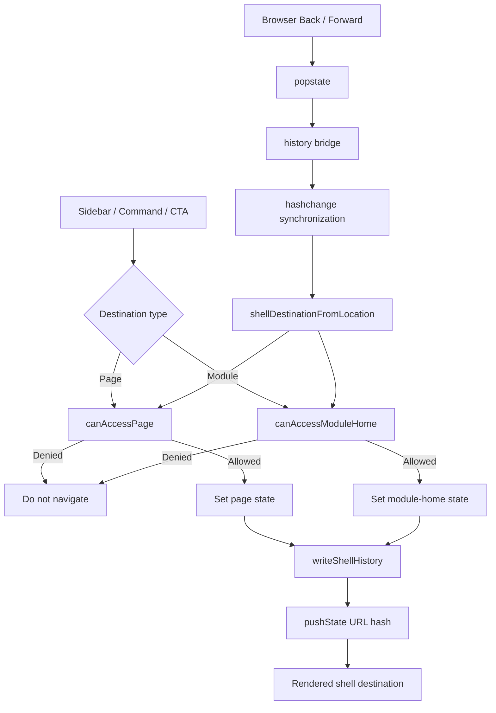
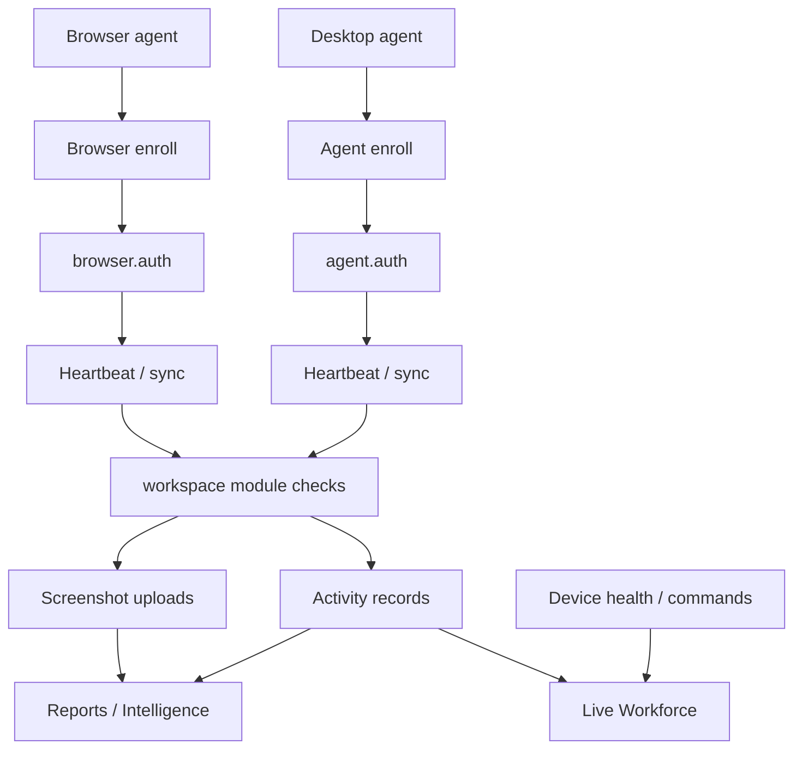

# WorkIntel System Architecture and Flow

This document is the canonical high-level map for the current WorkIntel Laravel + React application. It describes runtime ownership, route selection, private-shell navigation, authorization, data flow, tracking ingestion and UI boundaries. It is intended to be read before changing navigation, shared UI, permissions or cross-module behavior.

## 1. Runtime architecture

WorkIntel is one Laravel application with one browser entry point. Laravel owns HTTP routing, API middleware, controllers, services, persistence and public SEO context. React owns interactive browser surfaces. The browser path selects the correct React surface; the private workspace is not a separate frontend repository.



### Surface ownership

- `/` — public WorkIntel marketing website.
- Private application paths such as `/app#overview` — authenticated workforce shell.
- `/portal/*` — client portal.
- `/seller/*` — platform/operator surface.
- `/document-sign/*` — public document signing flow.
- `/site/*`, previews and verified website domains — Website Studio public renderer.
- `/health/live` and `/health/ready` — runtime health endpoints.
- `/api/v1/*` — API surface.

## 2. Private shell navigation

The private shell has one permission-aware navigation contract. Sidebar/module actions do not hard-link to arbitrary React pages. A destination is either a page or a module home. The destination is written into the URL hash so refresh and deep links remain addressable.



### Navigation invariant

`history.pushState()` does not emit `hashchange`. The shell therefore bridges `popstate` into its location synchronization event. Removing that bridge causes the address bar and rendered destination to diverge during browser Back/Forward navigation.

## 3. Workspace authorization pipeline

Frontend visibility is convenience and discoverability, not the security boundary. API requests are protected again on the server.

```mermaid
flowchart LR
    UI[React page / action] --> AR[apiRequest]
    AR --> API[/api/v1/*]
    API --> AUTH[auth:sanctum]
    AUTH --> RW[ResolveWorkspace]
    RW --> AUD[workspace.audit]
    AUD --> MOD{Module enabled?}
    MOD --> ENT{Entitlement allowed?}
    ENT --> PERM{Permission / scope allowed?}
    PERM --> CTRL[Controller]
    CTRL --> SVC[Domain service]
    SVC --> MODEL[Eloquent models]
    MODEL --> DB[(MySQL)]
    SVC --> STORE[(Media / file storage)]
```

Frontend access checks combine:

1. current workspace and role;
2. enabled module state;
3. plan/entitlement gates where applicable;
4. required page permissions;
5. navigation visibility configuration.

Server routes repeat the relevant module, entitlement and permission checks. UI hiding must never replace server authorization.

## 4. Product module map

The owner workspace exposes these major areas:

| Area | Primary capabilities |
| --- | --- |
| Home & Command Center | Home, Live Team |
| Work Management | Approvals, Projects, Tasks, Automation Studio |
| Collaboration | Team Chat |
| Time & Attendance | Scheduling, Attendance, Leave, Timesheets, shift templates |
| People & HR | People, HRIS, Organization, Performance |
| Workforce Operations | Activity, Apps & Sites, Screenshots, Field Workforce, Devices |
| Clients & Commerce | Clients, client payments, recurring invoices, client portal |
| Content Studio | Website Studio, Documents, Media Library |
| Finance & Payroll | Finance/expenses, Payroll, Payroll Compliance, Billing |
| Intelligence & Reports | Workforce Intelligence, Reports |
| Administration | Modules, Enterprise, Access Control, Settings, Trash/lifecycle |
| Account & Support | Downloads/installation, My Access |

Role manifests expose a subset of these destinations. Module state and permissions can narrow the subset further.

## 5. Workforce tracking ingestion

Desktop and browser tracking are separate authenticated ingestion channels. They produce operational signals; they do not bypass workspace capability gates.



Presence, tracked time, activity, screenshots and productivity interpretation are distinct concepts. UI and reporting should not label one signal as another.

## 6. Content and public publishing flow

Website Studio content can be rendered under `/site/{workspace}` or a verified custom website domain. Laravel resolves the site/page and emits SEO metadata before React renders the public website surface.

```mermaid
flowchart LR
    REQ[Public request] --> HOST{Verified website domain?}
    HOST -->|Yes| DOMAIN[Resolve WorkspaceDomain]
    HOST -->|No| SITE[/site/{workspace}]
    DOMAIN --> WS[Published WebsiteSite]
    SITE --> WS
    WS --> PAGE[Published WebsitePage + language fallback]
    PAGE --> META[Title / description / canonical / OG image]
    META --> BLADE[app.blade.php]
    BLADE --> RENDER[PublicWebsiteApp]
```

## 7. UI architecture rules

Shared primitives in `resources/js/design-system` own controls, overlays, tables, focus behavior, layout contracts and common states. Feature pages should compose these primitives instead of recreating buttons, dialogs, tables or form behavior locally.

The professional UI layer enforces:

- readable default typography and hierarchy;
- consistent control heights and visible focus states;
- responsive reflow rather than desktop-only shrinking;
- module-first information architecture;
- compact onboarding that does not cover operational content;
- keyboard and touch target operability;
- light/dark semantic tokens rather than hard-coded feature colors.

## 8. Accessibility certification model

Accessibility is treated as a release contract, not a visual spot check. The repository combines source checks and Playwright journeys for:

- semantic landmarks and skip links;
- accessible control names;
- focus trapping and Escape behavior;
- keyboard navigation;
- duplicate IDs and form labels;
- 200% equivalent reflow;
- reduced motion;
- RTL behavior;
- touch target sizing;
- WCAG AA contrast for semantic theme tokens.

WAVE can still be used as an external manual/independent check, but a WAVE badge or API result must not be claimed unless that external scan actually ran. Repository certification is W3C/WCAG-oriented and deterministic inside CI.

## 9. Source hygiene

`tools/dead-source-audit.mjs` walks the browser import graph from `resources/js/app.tsx`. Unreachable browser source and production `console.log`/`debugger` residue fail the build. Generated, temporary, backup and placeholder assets must not be committed as substitutes for real runtime assets.

When removing a file, verify both sides:

1. it is not referenced by runtime/build/test/docs contracts that require it;
2. the replacement, if any, is reachable and certified.

## 10. Change checklist for cross-cutting UI work

Before merging navigation or UI architecture changes:

- update this flow if runtime ownership changes;
- preserve server-side authorization even if navigation changes;
- test direct/deep URL, refresh, Back and Forward;
- run typecheck, frontend contracts and build;
- run accessibility source audit;
- run responsive/accessibility browser certification;
- verify no unreachable browser source or placeholder artifacts remain.
